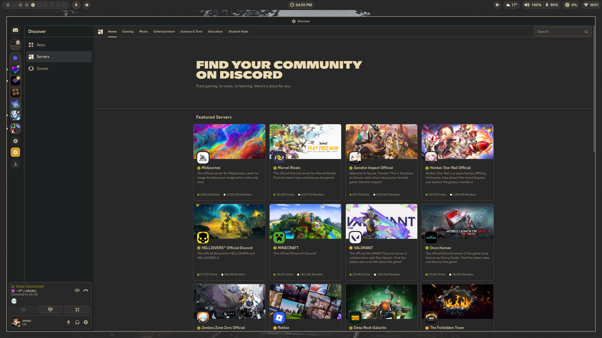

# Gruvbox Dark For New Discord's UI Style

The first most-completed Gruvbox Dark theme for Discord after the major UI update

<table border="1" style="border-color: #ebdbb2">
    <tr>
        <td></td>
        <td></td>
    </tr>
    <tr>
        <td></td>
        <td></td>
    </tr>
    <tr>
        <td></td>
        <td></td>
    </tr>
</table>
